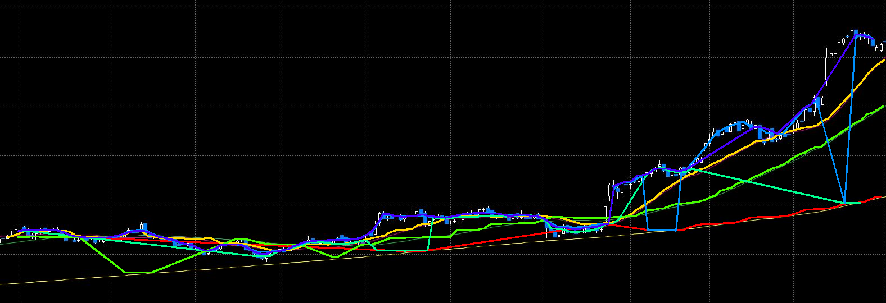
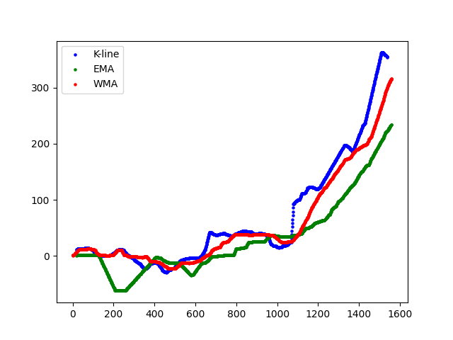
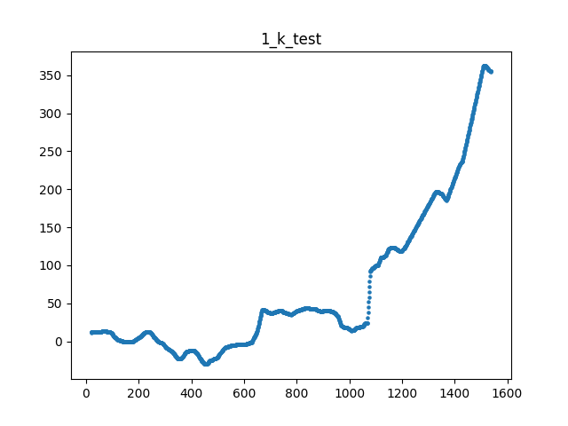

# Assignment 2

## Introduction

Data extraction from line-chart images is an essential component of the automated document understanding process. This project focuses on first extracting line chart data from the raw screenshot image, and then exploring the similarites among the extrated data.

## Workflow

### 1. Extract line chart data from image
We utilize techniques from the ICDAR 2023 paper, `LineFormer - Rethinking Chart Data Extraction as Instance Segmentation`, to extract line data through instance segmentation. The code is adapted from [LineFormer](https://github.com/TheJaeLal/LineFormer), and we use their pre-trained model directly for this task.

### 2. Extract the useful information from the extracted data

The line chart data extracted in the previous step is often messy and requires further preprocessing for downstream tasks.

For example, although Ticker1.png contains only 4 lines, the previous step identified 6 lines due to the difficulty of meticulous accurate detection. Using the extracted coordinates and replotting these 6 lines on the original image appears as follows:

Thus, we need to analyze these extracted lines to determine which lines are useful. This process involves manual testing, examining each line individually. Sttill using Ticker1.png as an example, we found that three detected lines are suitable for downstream tasks. We replot these three lines in another figure:

In this figure, the coordinates of these three lines have been adjusted so that the leftmost point of the entire figure is at (0,0). Although the original Ticker1.png lacks legend information, we infer that the corresponding lines should represent the k-line, EMA, and WMA. The SMA line, which seems to appear as the yellow line in the original Ticker1.png, is missing here (not detected), possibly due to its subtle yellow color. 

Similarly, we find and pick the k-line, EMA, and WMA lines from all extracted lines for the rest of 5 tickers. The coordinates of these three lines of all 6 tickers are saved in `./chart_extract_finetune_json` in the form of JSON files, and the replots of them can be found at `./chart_extract_finetune_replot`.

### 3.  Handling different lengths of the extracted coordinates among 6 Tickers

The extracted coordinates of the k-line, EMA, and WMA lines for each ticker may vary in length, which we need to address before calculating similarity. This is because, for example, when calculating the Pearson correlation between two vectors, they must have the same length. The details of the lengths of the extracted k-line, EMA, and WMA lines for each ticker can be found in `./length.txt`.

First, we observed significant fluctuations in the lengths of the EMA lines across 6 tickers, and the coordinates of some EMA lines are incorrect (possibly because the subtle green color of the EMA lines in the original image is hard to be detected), so we excluded EMA lines from the similarity analysis. Next, we found that, except for `k_line_1` (the extracted k-line for ticker 1), all other k-lines of the rest of tickers have a similar number of coordinates. The number of coordinates of `k_line_1` is low because there are some sparse points in the extracted `k_line_1`. Consdiering this, whenever dealing with `k_line_1`, we use interpolation to fill-in some coordinates and hence increase its length. An example of this interpolation is shown below (before interpolation and after interpolation):

On the other hand, all WMA lines across 6 tickers have a similar number of coordinates. Therefore, when comparing WMA lines between two tickers, such as `wma_line_4` and `wma_line_6`, we find the minimum length of the two lines and randomly remove few points from the longer line to align their lengths.

### 3.Pearson similarity, euclidean distance and procrustes distance

We calculate three types of similarity metrics — Pearson similarity, Euclidean distance, and Procrustes distance — for both K-lines and WMA lines of the 6 tickers.

Pearson similarity (Pearson correlation coefficient) measures the linear correlation between two sets of points. It ranges from -1 to 1, where 1 indicates a perfect positive linear relationship, -1 indicates a perfect negative linear relationship, and 0 indicates no linear relationship. In our case, each line is represented by two-dimensional coordinates (x, y), where x denotes the sequence of timestamps. Therefore, we focus solely on the y-axis (one-dimensional data) when calculating Pearson similarity between the lines.

Euclidean distance measures the straight-line distance between two points in Euclidean space. For two lines represented by their coordinates, the Euclidean distance quantifies the overall distance between the corresponding points on the two lines. We use 

Procrustes distance also measures the similarity between two data sets. More details can be found at [scipy.spatial.procrustes](https://docs.scipy.org/doc/scipy/reference/generated/scipy.spatial.procrustes.html)

### 4. results

We first calculate the Pearson similarity, euclidean distance and procrustes distance of WMA lines among 6 tickers.

After obtaining the 6x6 Pearson similarity matrix `wma_pearson_similarity_matrix`, we can fine-tune it with the 6x6 euclidean distance matrix `wma_euclidean_matrix` and the 6x6 procrustes distance matrix `wma_procrustes_matrix`. 

Specifically, we normalize the Euclidean distance and Procrustes distance matrices to be in the range of 0 to 1, and then use the simple average of these two distance matrices as weights:

`combined_distance_matrix = (normalized_wma_euclidean_matrix + normalized_wma_procrustes_matrix) / 2`

`weight_factor = 0.5`

`wma_weighted_pearson_similarity_matrix = wma_pearson_similarity_matrix * (1 - weight_factor * combined_distance_matrix)`

This weight factor value, 0.5, is determined through some initial tests and can be further fine-tuned.

Similarly, we apply the same process to the K-lines and obtain a weighted K-line similarity matrix `kline_weighted_pearson_similarity_matrix`.

Now we have two matrice, and we would like to produce a combined similarity matrix by weighted-averaging them:

`weight_factor = 0.7`

`final_similarity_matrix = weight_factor * wma_weighted_pearson_similarity_matrix + (1-weight_factor) * kline_weighted_pearson_similarity_matrix`

This factor value, 0.7, is chosen because we observed that WMA lines are extracted more accurately than K-lines.

The final matrix is presented below:

|          | Ticker 1    | Ticker 2    | Ticker 3    | Ticker 4    | Ticker 5    | Ticker 6    |
|----------|-------------|-------------|-------------|-------------|-------------|-------------|
| **Ticker 1** | 1.0000      | 0.9318      | 0.8701      | 0.3825      | 0.0815      | 0.3307      |
| **Ticker 2** | 0.9318      | 1.0000      | 0.8903      | 0.3949      | 0.1117      | 0.3472      |
| **Ticker 3** | 0.8701      | 0.8903      | 1.0000      | 0.4540      | 0.1904      | 0.4221      |
| **Ticker 4** | 0.3825      | 0.3949      | 0.4540      | 1.0000      | 0.6763      | 0.7918      |
| **Ticker 5** | 0.0815      | 0.1117      | 0.1904      | 0.6763      | 1.0000      | 0.7001      |
| **Ticker 6** | 0.3307      | 0.3472      | 0.4221      | 0.7918      | 0.7001      | 1.0000      |

All results can be reproduced using the code `matrix_produce.py`

